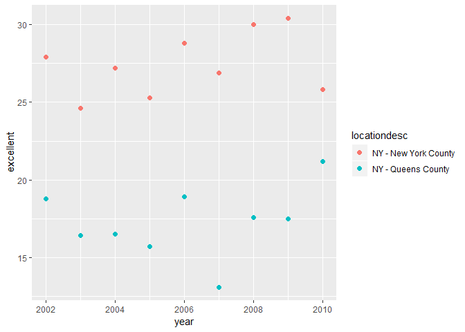

P8105 hw2
================
Jiawei Ye

Problem 1
---------

The following code chunk reads the data and do some cleaning.

``` r
nyc_transit = read.csv("./data/NYC_Transit_Subway_Entrance_And_Exit_Data.csv") %>% 
  janitor::clean_names() %>% 
  select(line:vending, ada, -exit_only) %>% 
  mutate(entry = recode(entry,"YES" = TRUE, "NO" = FALSE))
```

The cleaning steps in the above code chunk retained variables about the entrance/exits of a station and discarded more detailed information such as longitude/latitude of a specific entrance. It also changed the value of `entry` variable into logical value. The dimension of the dataset is 1868 rows and 19 columns. Each observation in the dataset is a subway station entrances/exits in NYC, the variables contains the stations name of the entrance/exit, the routes that run through it, the latitude and logitude of the station and ways to enter each station, whether the entrance/exit has vending, and ADA compliance. The dataset is not really tidy enough. The `route` variable needs to be combined in some way.

The following code chunk creates a tibble for distinct stations and do calculation.

``` r
dst_station = distinct(nyc_transit, station_name, line, .keep_all = TRUE)
n_dist_sta = nrow(dst_station)
n_ada_cmplt_stat = sum(dst_station$ada)

no_vending = nrow(filter(nyc_transit, vending == "NO"))
y_entrance = nrow(filter(nyc_transit, vending == "NO", entry == "TRUE"))
vending_proportion = (y_entrance/no_vending)*100
```

The code chunk shows that there are 465 distinct stations. 84 stations are ADA compliant. 37.7% of the entrances/exits without vending allow entrance.

The following code chunk reformats the dataset.

``` r
rfmt_transit =
  gather(dst_station, c(route1:route11), key = "route_order", value = "route") %>% 
  filter(!is.na(route)) %>% 
  arrange(route)
```

    ## Warning: attributes are not identical across measure variables;
    ## they will be dropped

The following code chunk prepares answers to the questions.

``` r
route_a_station = nrow(filter(rfmt_transit, route == "A"))
n_ada_cmplt_a_train = nrow(filter(rfmt_transit, route == "A", ada == TRUE))
```

60 distinct stations serve the A train.Of these stations, 17 are ADA compliant.

Problem 2
---------

The following code chunk reads, cleans the Mr. Trash Wheel dataset and creates dataset for precipitation.

``` r
mtw = read_excel("./data/HealthyHarborWaterWheelTotals2018-7-28.xlsx", 
                 sheet = 1, range = cell_cols("A:N")) %>% 
  janitor::clean_names() %>% 
  filter(!is.na(date))
mtw$sports_balls = round(mtw$sports_balls, digits = 0)
mtw$sports_balls = as.integer(mtw$sports_balls)

prcpt17 = read_excel("./data/HealthyHarborWaterWheelTotals2018-7-28.xlsx",
                     sheet = "2017 Precipitation", 
                     skip = 1) %>% 
  janitor::clean_names() %>% 
  filter(!is.na(month), !is.na(total)) %>% 
  mutate(year = 2017)
  
prcpt16 = read_excel("./data/HealthyHarborWaterWheelTotals2018-7-28.xlsx",
                     sheet = "2016 Precipitation",
                     skip = 1) %>%
  janitor::clean_names() %>% 
  filter(!is.na(total), !is.na(month)) %>% 
  mutate(year = 2016)

prcpt = full_join(prcpt16, prcpt17, by = "month") %>% 
  mutate(month = month.name) %>% 
  rename(total_2016 = total.x, total_2017 = total.y)

median_ball_2016 = median(filter(mtw, year == 2016)$sports_balls)
```

The trash wheel dataset has 285 observations. The key variable is `dumpster`, which identifies a certain dumpster. The dataset has information about the weight/number/volume of each kind of trash the dumpster collect, the date the trash are collected, and the number of homes these trash can power.
The precipitation dataset has 12 observations. the total precipitation in 2017 is 32.93. The key variable is `month`. The median number of sports balls in 2016 is 26.

Problem 3
---------

The following code chunk loads data.

``` r
devtools::install_github("p8105/p8105.datasets")
```

    ## Skipping install of 'p8105.datasets' from a github remote, the SHA1 (21f5ad1c) has not changed since last install.
    ##   Use `force = TRUE` to force installation

``` r
library(p8105.datasets)
data("brfss_smart2010")
```

The following code chunk cleans the data.

``` r
brfss_smart2010 = 
  janitor::clean_names(brfss_smart2010) %>%
  filter(topic == "Overall Health") %>% 
  select(-class, -topic, -question, -sample_size, 
         -c(confidence_limit_low:geo_location)) %>% 
  filter(!is.na(data_value)) %>%
  spread(response, data_value) %>% 
  janitor::clean_names() %>% 
  mutate(exce_or_vg = excellent + very_good)
```

The following code chunk prepares for the answers to the questions.

``` r
unq_loca = nrow(distinct(brfss_smart2010, locationdesc))
num_states = nrow(distinct(brfss_smart2010, locationabbr))
brfss_smart2010 %>% 
  count(locationabbr) %>% 
  arrange(desc(n)) %>% 
  top_n(1)
```

    ## Selecting by n

    ## # A tibble: 1 x 2
    ##   locationabbr     n
    ##   <chr>        <int>
    ## 1 NJ             144

``` r
m_exc = median(filter(brfss_smart2010, year == "2002")$excellent)
```

There are 404 unique locations in the dataset. The number of states represented is 51 therefore every state is represented. New Jersy is observed the most.
In 2002, the median of the "Excellent" response value is 23.6.

The following code chunk creates graphs.

``` r
ggplot(filter(brfss_smart2010, year == "2002"),
       aes(x = excellent)) +
       geom_histogram()
```

    ## `stat_bin()` using `bins = 30`. Pick better value with `binwidth`.


``` r
ggplot(filter(brfss_smart2010, 
             (year >= 2002) & (year <= 2010), 
              (locationdesc == "NY - New York County") | (locationdesc == "NY - Queens County")), 
        aes(x = year, y = excellent)) + 
        geom_point(aes(color = locationdesc), size = 2)
```


